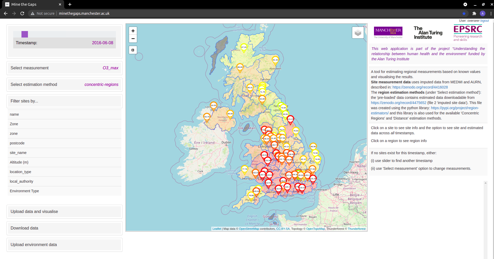
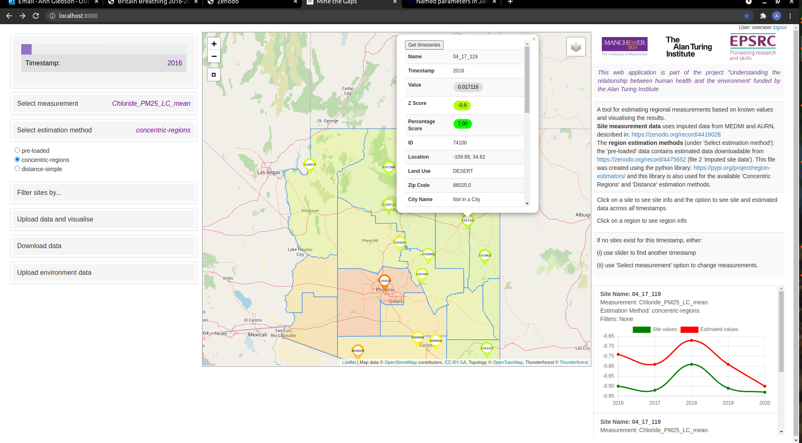

[](https://github.com/UoMResearchIT/geo_sensor_gaps/actions/workflows/django.yml)

The sections below are:
- [About](#about)
- [Example screenshots](#example-screenshots)
- [User instructions](#user-instructions)
- [Install and test locally](#install-and-test-locally)
  - [Clone this repository](#clone-this-repository)
  - [Add a local.py Django settings file](#add-a-localpy-django-settings-file)  
  - [Installation](#installation)
    - [Docker Container](#docker-container)
    - [Full database and Django set-up](#full-database-and-django-set-up)
- [Deployment](#deployment)  

- [Research](#research)  
- [Copyright and Licensing](#copyright--licensing)

<!-- toc -->

## About
A Django web application to display sensor data on a map and allow comparison with regional estimates.
All data is loaded into the web app's database by the (admin) user at run-time, from 4 CSV files 
which comprise 2 data files and 2 metadata files. 
Example data files are provided in the `/examples` folder.  

Regional estimates can also be calculated at run-time. The estimation methods 
are those available in the python library: https://pypi.org/project/region-estimators 
('concentric-regions' and 'distance-simple' at time of writing)

Users can also upload their own data locally (within a browser session), 
again via a CSV file upload, allowing their own data to be compared alongside the 
actuals/estimates data pre-loaded by admin.


# Example screenshots

## Example with daily UK AQ data
(currently running on our web app deployment: see http://minethegaps.manchester.ac.uk/)


## Example with yearly Arizona Chloride PM2.5 LC data


# User instructions

See our [user instructions readme](README_instructions.md) for general and admin user instructions on
how to use this web application
(and try this out on our example deployment: [mine-the-gaps](http://minethegaps.manchester.ac.uk/))


# Install and test locally
The following instructions are to get this Django web app running on any machine, using a browser
and localhost.

## Clone this repository 
Make a copy of this code on your computer by:

`cd ~/Code/` [cd to a folder on your local machine where you would like to install this code]

and then either:

`git clone  https://github.com/UoMResearchIT/geo_sensor_gaps.git`

or:

 click on 'Code' on this github repository homepage, then 'Download ZIP' and save to your chosen folder.
 Then extract this zip file.

## Add a local.py Django settings file

Using the `geo_sensor_gaps/settings/local.template` file as a template, 
create a new file `geo_sensor_gaps/settings/local.py`  (this should be in same folder as 
`local.template` and `base.py`)

Fill in the `MAX_NUM_PROCESSORS` value with an integer representing the maximum number of processors
you wish to have available for this web application. This defaults to the number available minus 1.


## Installation
You can either use our docker container (recommended for novices) or follow the full postgreSQL/postGIS 
database and Django set-up (more difficult).

### Docker Container
We use [Docker](https://www.docker.com/) to create a container for easy set-up on any Linux, 
Mac or Windows machine. As an easy-to-use front-end we use [Docker Compose](https://docs.docker.com/compose/) 
which is a tool for managing docker:
```text
Compose is a tool for defining and running multi-container Docker applications. With Compose, you use a YAML file to 
configure your application’s services. Then, with a single command, you create and start all the services from your 
configuration. 
```

#### Install Docker Compose
Install Docker Compose using their [Install Compose](https://docs.docker.com/compose/install/#install-compose) 
instructions. Once installed, test your docker and docker-compose installations:

```shell
$ docker --version
Docker version 20.10.7, build f0df350

$ docker-compose --version
docker-compose version 1.29.2, build 5becea4c
```

#### Create a .docker-env file for environment variables
Using the `/geo_sensor_gaps/settings/.docker-env.template`, copy this file to 
`/geo_sensor_gaps/settings/.docker-env`
then fill in the `SECRET_KEY` value with a newly generated key (string) 
(e.g you could try this online secret_key generator https://djecrety.ir/)

All other fields should remain the same.
```text
GEO_SENSOR_GAPS_DEBUG=True
GEO_SENSOR_GAPS_SECRET_KEY=[INSERT A SECRET_KEY HERE]
GEO_SENSOR_GAPS_ALLOWED_HOSTS=localhost 127.0.0.1 [::1]

GEO_SENSOR_GAPS_SQL_ENGINE=django.contrib.gis.db.backends.postgis
GEO_SENSOR_GAPS_SQL_DATABASE=postgres
GEO_SENSOR_GAPS_SQL_USER=postgres
GEO_SENSOR_GAPS_SQL_PASSWORD=postgres
GEO_SENSOR_GAPS_SQL_HOST=db
GEO_SENSOR_GAPS_SQL_PORT=5432
```

#### Run the docker container
Run the container by changing to the project directory:\
`cd [my_code_folder]/geo_sensor_gaps`

and then the following command starts the 2 docker containers (one for the web app and one for 
the postgis database):\
`sudo docker-compose up -d`

The docker containers will now run in the background (`-d` specifies run as detached process) 
until they are stopped. To see a list of all running containers, run either:\
`sudo docker ps`\
or\
`sudo docker container ls`

If both containers are running as expected, the output should show the two containers running: 
one for the `geo_sensor_gaps_webapp` and another for a `postgis` database image.
The output should look something like:\

```
CONTAINER ID   IMAGE                COMMAND                  CREATED          STATUS          PORTS                                       NAMES
88a4aeebe9a8   geo_sensor_gap_web   "/entrypoint /start"     56 minutes ago   Up 56 minutes   0.0.0.0:8000->8000/tcp, :::8000->8000/tcp   geo_sensor_gaps_web_1
31f5a454ff2b   postgis/postgis      "docker-entrypoint.s…"   56 minutes ago   Up 56 minutes   5432/tcp                                    geo_sensor_gaps_db_1
```
If the output does not look like above, then try running:\
`sudo docker-compose logs -f`\
which gives you a detailed log file, showing all logs, including errors, for both containers.

To stop the docker container run:\
`sudo docker-compose  down`\
*Note that in the current set-up, once the container is stopped, any admin users and loaded data 
(added using instructions below) will be lost.*

#### Test the web app on localhost
Whilst the docker container is running, test the web application by opening `localhost:8000` in a browser.\
*Note: you may have to wait a few seconds after running the above `sudo docker-compose up` command 
before the browser is able to open the link.*
*Note that no data has been loaded yet, so the map will be empty.*\


#### How to set up admin users on the web app
To load data, an admin user is required. To set up an admin user (aka superuser), we need to run the 
Django management tool (which runs within the docker container). 
Run:\
`sudo docker-compose run web python manage.py createsuperuser`\
This will ask several questions via the command line. Once the superuser is set up,
that user can log in to the web application.

#### Log in as superuser and upload data
Return to the web application on your browser (`localhost:8000`) and click on `admin login` in the 
top right-hand side of the main page.  Use the new admin log-in credentials to log in.

See our [instructions for admin users](README_instructions.md#admin-users) for admin user instructions 
on how to use this web application, including how to upload data.

### Full database and Django set-up
  
  These instructions are based on the Ubuntu OS. They will need to be adapted to run on other Linux distributions,
  Windows and other OSs.

  This web app is tested on python versions 3.7, 3.8 and 3.9

        sudo apt-get update
        sudo apt-get install -y libproj-dev libgeos-dev gdal-bin libgdal-dev libsqlite3-mod-spatialite
        python -m pip install --upgrade pip

#### Virtual Environment

See https://docs.python.org/3/tutorial/venv.html for instruction on how to set up a virtual environment 
(recommended). This virtual environment will hold the required version of Python, Django and other 
necessary modules.

To activate your new virtual environment run:

`source venv/bin/activate` [Replace 'venv' with the path to your new virtual environment]
      
#### Install Django and additional modules. 

Ensure that your newly created virtual environment is activated (see above), and then run:

    cd [code-directory] [Replace [code-directory] with the path of the project folder that contains requirements.txt]
    pip install -r requirements.txt

#### Install the PostGIS (Spatial PostreSQL database)
As this web app requires geographical functionality, we can't rely only on Django's default
database set-up. We require a database that can hold and process geo-spatial data and 
PostGIS is used for this purpose.
For general documentation on PostGIS see https://postgis.net/docs/

Within the above instructions, there are installation instructions found at: 
https://postgis.net/docs/postgis_installation.html#install_short_version

For instructions on using PostGIS with Django:
https://docs.djangoproject.com/en/3.2/ref/contrib/gis/install/postgis/

#### Add a .envs file

Using the `geo_sensor_gaps/settings/.env.template`, copy this file to `geo_sensor_gaps/settings/.env`
then fill in the `SECRET_KEY` value with a newly generated key (string) 
(e.g try this online key generator https://djecrety.ir/)

Fill in the other database log-in values with your own: Replace the NAME, USER and PASSWORD values with 
those set up when you created your  PostGIS database in previous step.

```text
GEO_SENSOR_GAPS_SECRET_KEY=[INSERT_YOUR_SECRET_KEY]
GEO_SENSOR_GAPS_ALLOWED_HOSTS=localhost 127.0.0.1 [::1]
GEO_SENSOR_GAPS_SQL_DATABASE=geo_sensor_gaps [OR REPLACE WITH YOUR DB NAME]
GEO_SENSOR_GAPS_SQL_USER=geo_sensor_gaps_user [OR REPLACE WITH YOUR DB USER NAME]
GEO_SENSOR_GAPS_SQL_PASSWORD=[INSERT_YOUR_DB_PASSWORD]
GEO_SENSOR_GAPS_SQL_HOST=localhost
```

#### Check Django installation
Ensure your new virtual environment is activated, and then you can check Django is installed using the following
online set-up instructions.

*Note that Django has already been installed in the previous step*
https://docs.djangoproject.com/en/3.2/intro/install/


#### Run the development server
Ensure that the new virtual environment is activated and run:

 `cd [code-directory]` [Replace [code-directory] with the path of the project folder that contains requirements.txt]

optional test:\
`python manage.py test`\
and run:\
`python manage.py runserver`

The output to the last command should be similar to:

```shell
$ python manage.py runserver

Watching for file changes with StatReloader
Performing system checks...

System check identified no issues (0 silenced).
July 22, 2021 - 16:15:44
Django version 3.2.5, using settings 'geo_sensor_gaps.settings.dev'
Starting development server at http://127.0.0.1:8000/
Quit the server with CONTROL-C.
```
Using your browser, navigate to http://127.0.0.1:8000/ (or the link shown in your output) and this should 
open up the web-application. *Note that no data has been loaded yet, so the map will be empty.*

#### How to set admin users
To load data, an admin user is required. To set up an admin user (aka superuser), we need to run the 
Django management tool, from the same project directory as in previous steps:\
Run:\
`python manage.py createsuperuser`\
This will ask several questions via the command line. Once the superuser is set up,
that user can log in to the web application.

#### Log in as superuser and upload data
Return to the web application on your browser (`localhost:8000`) and click on `admin login` in the 
top right-hand side of the main page.  Use the new admin log-in credentials to log in.

See our [instructions for admin users](README_instructions.md#admin-users) for admin user instructions 
on how to use this web application, including how to upload data.

See the Django documents for more details on setting up user authentication:
https://docs.djangoproject.com/en/3.2/topics/auth/default/

# Deployment
See the Django documentation for deploying Django applications: 
https://docs.djangoproject.com/en/3.2/howto/deployment/

# Research

## Acknowledgement
This web application is part of the project "Understanding the relationship between human health 
and the environment' funded by the Alan Turing Institute

## Authors
Ann Gledson, Douglas Lowe, Manuele Reani, David Topping and Caroline Jay


# Copyright & Licensing

This software has been developed by Ann Gledson from the 
[Research IT](https://research-it.manchester.ac.uk/) 
group at the [University of Manchester](https://www.manchester.ac.uk/).

(c) 2020-2021 University of Manchester.
Licensed under the MIT license, see the file LICENSE for details.


  


